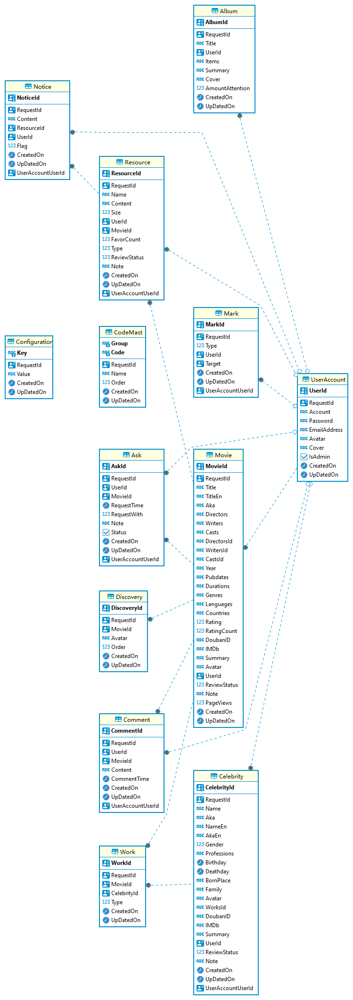

# 1. 数据库设计

### 1-1. **[Album 影集](#jump_Album)**
### 1-2. **[Ask 资源请求](#jump_Ask)**
### 1-3. **[Celebrity 影人详细](#jump_Celebrity)**
### 1-4. **[Comment 评论](#jump_Comment)**
### 1-5. **[Configuration 配置设定](#jump_Configuration)**
### 1-6. **[Discovery 电影每日发现](#jump_Discovery)**
### 1-7. **[Country 制片国家/地区](#jump_Country)** <span style="display:block;color:orangered;">(已经废弃 -> CODE管理表)</span>
### 1-8. **[GenreMovie 电影类型](#jump_GenreMovie)** <span style="display:block;color:orangered;">(已经废弃 -> CODE管理表)</span>
### 1-9. **[Language 语言](#jump_Language)** <span style="display:block;color:orangered;">(已经废弃 -> CODE管理表)</span>
### 1-10. **[CodeMast CODE管理表](#jump_CodeMast)**
### 1-11. **[Mark 标记信息](#jump_Mark)**
### 1-12. **[Movie 电影](#jump_Movie)**
### 1-13. **[Resource 影片资源](#jump_Resource)**
### 1-14. **[UserAccount 账户信息](#jump_UserAccount)**
### 1-15. **[Notice 通知](#jump_Notice)**
### 1-16. **[Work 工作](#jump_Work)**

# 2. 业务表关系
### 2-1. **[ER图](#jump_ER)**

***（以下类型秒数是基于postgresql数据库）***
## 业务表结构

<a id="jump_Album"></a>
### [影集] Album
| 列名            |   类型    | 长度 | 标度 | 精度 | 非空 |  PK |  FK | 默认值 | 描述                                                                  | VO                |
| :-------------- | :-------: | ---: | ---: | ---: | ---: | --: | --: | :----- | --------------------------------------------------------------------- | ----------------- |
| RequestId       |   uuid    |   36 |      |      |    v |     |     |        | GUID                                                                  | RequestIdVO       |
| AlbumId         |   uuid    |   36 |      |      |    v |   v |     |        | 主键                                                                  | AlbumIdVO         |
| Title           |  varchar  |   50 |      |      |    v |     |     |        | 影集名称                                                              | TitleVO           |
| UserId          |   uuid    |   36 |      |      |    v |     |   v |        | 登录者ID<BR>（与 UserAccount.UserId 有外键关系）                      | UserIdVO          |
| Items           |   text    |   -1 |      |      |      |     |     |        | 电影对象<BR>（以json格式保存的电影集合，与 Movie.MovieId 有外键关系） | ItemsVO           |
| Summary         |   text    |   -1 |      |      |      |     |     |        | 简介                                                                  | SummaryVO         |
| Cover           |  varchar  |  100 |      |      |      |     |     |        | 封面（带扩展名）                                                      | CoverVO           |
| AmountAttention |  numeric  |    4 |      |    0 |      |     |     | 0      | 关注数                                                                | AmountAttentionVO |
| CreatedOn       | timestamp |    8 |    3 |   23 |    v |     |     |        | 创建时间                                                              | CreatedOnVO       |
| UpDatedOn       | timestamp |    8 |    3 |   23 |      |     |     |        | 修改时间                                                              | UpDatedOnVO       |

- Item的数据规则
  - ```[{"Movie":"m0002","Note":"","Time":"2023/10/23 23:21:03","MovieInfo":null},{"Movie":"m0003","Note":"","Time":"2023/10/23 23:39:22","MovieInfo":null}]```


<a id="jump_Ask"></a>
### [资源请求] Ask
| 列名        |   类型    | 长度 | 标度 | 精度 | 非空 |  PK |  FK | 默认值 | 描述                                         | VO            |
| :---------- | :-------: | ---: | ---: | ---: | ---: | --: | --: | :----- | -------------------------------------------- | ------------- |
| RequestId   |   uuid    |   36 |      |      |    v |     |     |        | GUID                                         | RequestIdVO   |
| AskId       |   uuid    |   36 |      |      |    v |   v |     |        | 主键                                         | AskIdVO       |
| UserId      |   uuid    |   36 |      |      |    v |     |   v |        | 登录者ID<BR>（与 UserAccount.UserId 有外键关系） | UserIdVO      |
| MovieId     |   uuid    |   36 |      |      |    v |     |   v |        | 电影ID<BR>（与 Movie.MovieId 有外键关系）        | MovieIdVO     |
| RequestTime | timestamp |    8 |    3 |   23 |      |     |     |        | 请求时间                                     | RequestTimeVO |
| RequestWith |  numeric  |    4 |      |   10 |      |     |     | 0      | 被请求的数量                                 | RequestWithVO |
| Note        |  varchar  | 1000 |      |      |      |     |     |        | 备注                                         | NoteVO        |
| Status      |   bool    |    1 |      |    1 |      |     |     | false  | 状态<BR>(1:已求到 0:未求到)                      | StatusVO      |
| CreatedOn   | timestamp |    8 |    3 |   23 |    v |     |     |        | 创建时间                                     | CreatedOnVO   |
| UpDatedOn   | timestamp |    8 |    3 |   23 |      |     |     |        | 修改时间                                     | UpDatedOnVO   |


<a id="jump_Celebrity"></a>
### [影人详细] Celebrity
| 列名         |   类型    | 长度 | 标度 | 精度 | 非空 |  PK |  FK | 默认值 | 描述                                         | VO             |
| :----------- | :-------: | ---: | ---: | ---: | ---: | --: | --: | :----- | -------------------------------------------- | -------------- |
| RequestId    |   uuid    |   36 |      |      |    v |     |     |        | GUID                                         | RequestIdVO    |
| CelebrityId  |   uuid    |   36 |      |      |    v |   v |     |        | 主键                                         | CelebrityIdVO  |
| Name         |  varchar  |   50 |      |      |    v |     |     |        | 明星姓名（中文名）                           | NameVO         |
| Aka          |  varchar  |  500 |      |      |      |     |     |        | 更多中文名<BR>（使用"/"分割）                    | AkaVO          |
| NameEn       |  varchar  |   50 |      |      |      |     |     |        | 明星姓名（外文名）                           | NameEnVO       |
| AkaEn        |  varchar  |  500 |      |      |      |     |     |        | 更多外文名<BR>（使用"/"分割）                    | AkaEnVO        |
| Gender       |   int2    |      |      |      |      |     |     |        | 性别<BR>（0:无 1:男 2:女）                       | GenderVO       |
| Professions  |  varchar  |   50 |      |      |      |     |     |        | 职业<BR>（使用"/"分割）                          | ProfessionsVO  |
| Birthday     |   date    |      |      |      |      |     |     |        | 出生日期                                     | BirthdayVO     |
| Deathday     |   date    |      |      |      |      |     |     |        | 生卒日期                                     | DeathdayVO     |
| BornPlace    |  varchar  |  100 |      |      |      |     |     |        | 出生地                                       | BornPlaceVO    |
| Family       |  varchar  |  500 |      |      |      |     |     |        | 家庭成员（使用"/"分割）                      | FamilyVO       |
| Avatar       |  varchar  |  100 |      |      |      |     |     |        | 明星海报（带扩展名）                         | AvatarVO       |
| Works        |  varchar  | 1000 |      |      |      |     |     |        | 作品？                                       | WorksVO        |
| DoubanID     |  varchar  |   10 |      |      |      |     |     |        | 豆瓣影人编号（可以导航至豆瓣板块）           | DoubanIDVO     |
| IMDb         |  varchar  |   10 |      |      |      |     |     |        | IMDb编号                                     | IMDbVO         |
| Summary      |   text    |   -1 |      |      |      |     |     |        | 影人简介                                     | SummaryVO      |
| UserId       |   uuid    |   36 |      |      |    v |     |   v |        | 登录者ID<BR>（与 UserAccount.UserId 有外键关系） | UserIdVO       |
| ReviewStatus |   int2    |    1 |      |    3 |      |     |     | 0      | 状态<BR>（0:默认值 1:评审不通过 2:通过）         | ReviewStatusVO |
| Note         |  varchar  | 1000 |      |      |      |     |     |        | 评审信息<BR>（0:内容有误 1:已经存在 other:其他） | NoteVO         |
| CreatedOn    | timestamp |    8 |    3 |   23 |    v |     |     |        | 创建时间                                     | CreatedOnVO    |
| UpDatedOn    | timestamp |    8 |    3 |   23 |      |     |     |        | 修改时间                                     | UpDatedOnVO    |


<a id="jump_Comment"></a>
### [评论] Comment
| 列名        |   类型    | 长度 | 标度 | 精度 | 非空 |  PK |  FK | 默认值 | 描述                                         | VO            |
| :---------- | :-------: | ---: | ---: | ---: | ---: | --: | --: | :----- | -------------------------------------------- | ------------- |
| RequestId   |   uuid    |   36 |      |      |    v |     |     |        | GUID                                         | RequestIdVO   |
| CommentId   |   uuid    |   36 |      |      |    v |   v |     |        | 主键                                         | CommentIdVO   |
| UserId      |   uuid    |   36 |      |      |    v |     |   v |        | 登录者ID<BR>（与 UserAccount.UserId 有外键关系） | UserIdVO      |
| MovieId     |   uuid    |   36 |      |      |    v |     |   v |        | 电影ID<BR>（与 Movie.MovieId 有外键关系）        | MovieIdVO     |
| Content     |   text    |   -1 |      |      |      |     |     |        | 内容                                         | ContentVO     |
| CommentTime | timestamp |    8 |    3 |   23 |      |     |     |        | 评论时间                                     | CommentTimeVO |
| CreatedOn   | timestamp |    8 |    3 |   23 |    v |     |     |        | 创建时间                                     | CreatedOnVO   |
| UpDatedOn   | timestamp |    8 |    3 |   23 |      |     |     |        | 修改时间                                     | UpDatedOnVO   |


<a id="jump_Configuration"></a>
### [配置设定] Configuration
| 列名      |   类型    | 长度 | 标度 | 精度 | 非空 |  PK |  FK | 默认值 | 描述     | VO          |
| :-------- | :-------: | ---: | ---: | ---: | ---: | --: | --: | :----- | -------- | ----------- |
| RequestId |   uuid    |   36 |      |      |    v |     |     |        | GUID     | RequestIdVO |
| Key       |  varchar  |   50 |      |      |    v |   v |     |        | 主键     | KeyVO       |
| Value     |  varchar  |   50 |      |      |      |     |     |        | 值       | ValueVO     |
| CreatedOn | timestamp |    8 |    3 |   23 |    v |     |     |        | 创建时间 | CreatedOnVO |
| UpDatedOn | timestamp |    8 |    3 |   23 |      |     |     |        | 修改时间 | UpDatedOnVO |


<a id="jump_Discovery"></a>
### [电影每日发现] Discovery
| 列名        |   类型   | 长度 | 标度 | 精度 | 非空 |  PK |  FK | 默认值 | 描述                                  | VO            |
| :---------- | :------: | ---: | ---: | ---: | ---: | --: | --: | :----- | ------------------------------------- | ------------- |
| RequestId   |   uuid   |   36 |      |      |    v |     |     |        | GUID                                  | RequestIdVO   |
| DiscoveryId |   uuid   |   36 |      |      |    v |   v |     |        | 主键                                  | DiscoveryIdVO |
| MovieId     |   uuid   |   36 |      |      |    v |     |   v |        | 电影ID<BR>（与 Movie.MovieId 有外键关系） | MovieIdVO     |
| Image       | varchar  |  100 |      |      |    v |     |     |        | 图片<BR>（带扩展名）                      | ImageVO       |
| Flag        | numeric  |    3 |      |    0 |    v |     |     |        | 表示顺位                              | FlagVO        |
| CreatedOn   | datetime |    8 |    3 |   23 |    v |     |     |        | 创建时间                              | CreatedOnVO   |
| UpDatedOn   | datetime |    8 |    3 |   23 |      |     |     |        | 修改时间                              | UpDatedOnVO   |


<a id="jump_Movie"></a>
### [电影] Movie
| 列名         |   类型    | 长度 | 标度 | 精度 | 非空 |  PK |  FK | 默认值 | 描述                                                                     | VO             |
| :----------- | :-------: | ---: | ---: | ---: | ---: | --: | --: | :----- | ------------------------------------------------------------------------ | -------------- |
| RequestId    |   uuid    |   36 |      |      |    v |     |     |        | GUID                                                                     | RequestIdVO    |
| MovieId      |   uuid    |   36 |      |      |    v |   v |     |        | 电影ID                                                                   | MovieIdVO      |
| Title        |  varchar  |   50 |      |      |    v |     |     |        | 电影名称（中文描述）                                                     | TitleVO        |
| TitleEn      |  varchar  |  100 |      |      |      |     |     |        | 电影名称（英文描述）                                                     | TitleEnVO      |
| Aka          |  varchar  |  300 |      |      |      |     |     |        | 电影别名                                                                 | AkaVO          |
| Directors    |  varchar  |  500 |      |      |      |     |     |        | 导演名列表                                                               | DirectorsVO    |
| Writers      |  varchar  |  500 |      |      |      |     |     |        | 编剧名列表                                                               | WritersVO      |
| Casts        |  varchar  |  500 |      |      |      |     |     |        | 演员名列表                                                               | CastsVO        |
| DirectorsId  |  varchar  | 1000 |      |      |      |     |     |        | 导演ID列表                                                               | DirectorsIdVO  |
| WritersId    |  varchar  | 1000 |      |      |      |     |     |        | 编剧ID列表                                                               | WritersIdVO    |
| CastsId      |  varchar  | 1000 |      |      |      |     |     |        | 演员ID列表                                                               | CastsIdVO      |
| Year         |  varchar  |   10 |      |      |      |     |     |        | 年代                                                                     | YearVO         |
| Pubdates     |  varchar  |  200 |      |      |      |     |     |        | 上映日期                                                                 | PubdatesVO     |
| Durations    |  varchar  |   10 |      |      |      |     |     |        | 时长                                                                     | DurationsVO    |
| Genres       |  varchar  |  400 |      |      |      |     |     |        | 类型列表<BR>（必须使用"/"进行分割，与 GenreMovie.genre_Id 有外键关系）       | GenresVO       |
| Languages    |  varchar  |  400 |      |      |      |     |     |        | 语言列表<BR>（必须使用"/"进行分割，与 Language.lang_Id 有外键关系）          | LanguagesVO    |
| Countries    |  varchar  |  400 |      |      |      |     |     |        | 制片国家/地区列表<BR>（必须使用"/"进行分割，与 Country.genre_Id 有外键关系） | CountriesVO    |
| Rating       |  numeric  |    4 |    3 |    1 |      |     |     | 0.0    | 评分<BR>（0.0 ~ 10.0之间）                                                   | RatingVO       |
| RatingCount  |   int4    |      |      |      |      |     |     | 0      | 评分人数                                                                 | RatingCountVO  |
| DoubanID     |  varchar  |   10 |      |      |      |     |     |        | 豆瓣编号<BR>（可以导航至豆瓣板块）                                           | DoubanIDVO     |
| IMDb         |  varchar  |   10 |      |      |      |     |     |        | IMDb编号                                                                 | IMDbVO         |
| Summary      |   text    |   -1 |      |      |      |     |     |        | 电影简介                                                                 | SummaryVO      |
| Avatar       |  varchar  |  100 |      |      |      |     |     |        | 电影海报<BR>（带扩展名）                                                     | AvatarVO       |
| UserId       |   uuid    |   36 |      |      |      |     |   v |        | 登录者ID<BR>（与 UserAccount.UserId 有外键关系）                             | UserIdVO       |
| ReviewStatus |   int2    |    1 |      |      |      |     |     | 0      | 状态<BR>（0:默认值 1:评审不通过 2:通过）                                     | ReviewStatusVO |
| Note         |  varchar  | 1000 |      |      |      |     |     |        | 评审信息<BR>（0:内容有误 1:已经存在 other:其他）                             | NoteVO         |
| PageViews    |  numeric  |   11 |   11 |    0 |      |     |     | 0      | 浏览量                                                                   | PageViewsVO    |
| CreatedOn    | timestamp |    8 |    3 |   23 |    v |     |     |        | 创建时间                                                                 | CreatedOnVO    |
| UpDatedOn    | timestamp |    8 |    3 |   23 |      |     |     |        | 修改时间                                                                 | UpDatedOnVO    |

- 以下列举导演、编剧、演员导航与数据对应关系和使用规则  ***（必须使用"/"进行分割，与Celebrity.Id有外键关系）***
  - 多名演员列表导航
    - Casts = "约翰尼·德普 / 薇诺娜·瑞德 / 黛安·韦斯特" && CastsId = "001/005/006"

  - 导演列表导航（既是导演又是编剧的情况）
    - Directors = "蒂姆·波顿" && DirectorsId = "003" && WritersId = "003"

  - 编剧列表导航（其中有一位导演的情况）
    - Writers = "蒂姆·波顿 / 卡罗琳·汤普森" && DirectorsId = "003" && WritersId = "003/004"

- 以下是 Status 与 Note 的使用规则
  - 发布电影信息时（一般用户）：Status = 1 && Note = ""
  - 发布电影信息时（管理员）：Status = 2 && Note = ""
  - 评审电影信息时（通过）：Status = 2 && Note = ""
  - 评审电影信息时（不通过）：Status = 1 && Note = "（0:内容有误 1:已经存在 other:其他）"

- 电影最新与热门的数据规则
  - 最新：Status = 1（以 CreatedOn 降序取前20件数据）
  - 热门：Status = 2（以 PageViews 降序取前20件数据）
  

#### <span style="display:block;color:orangered;">(Country、GenreMovie、Language 这三个实体使用CodeMast进行管理)</span>

<a id="jump_Country"></a>
### [制片国家/地区] Country <span style="display:block;color:orangered;">(已经废弃 -> CODE管理表)</span>
| 列名         |   类型   | 长度 | 标度 | 精度 | 非空 |  PK | 默认值 | 描述 |
| :----------- | :------: | ---: | ---: | ---: | ---: | --: | -----: | :------- |
| country_Id   | tinyint  |    1 |      |    3 |    v |   v |        | ID       |
| country_Name | nvarchar |   50 |      |      |    v |     |        | 国家名   |

<a id="jump_GenreMovie"></a>
### [电影类型] GenreMovie <span style="display:block;color:orangered;">(已经废弃 -> CODE管理表)</span>
| 列名       |   类型   | 长度 | 标度 | 精度 | 非空 |  PK | 默认值 | 描述 |
| :--------- | :------: | ---: | ---: | ---: | ---: | --: | -----: | :------- |
| genre_Id   | tinyint  |    1 |      |    3 |    v |   v |        | ID       |
| genre_Name | nvarchar |   50 |      |      |    v |     |        | 电影类型 |

<a id="jump_Language"></a>
### [语言] Language <span style="display:block;color:orangered;">(已经废弃 -> CODE管理表)</span>
| 列名      |   类型   | 长度 | 标度 | 精度 | 非空 |  PK | 默认值 | 描述 |
| :-------- | :------: | ---: | ---: | ---: | ---: | --: | -----: | :------- |
| lang_Id   | tinyint  |    1 |      |    3 |    v |   v |        | ID       |
| lang_Name | nvarchar |   50 |      |      |    v |     |        | 语言     |

<a id="jump_CodeMast"></a>
### [语言] CodeMast
| 列名      |   类型    | 长度 | 标度 | 精度 | 非空 |  PK |  FK | 默认值 | 描述     | VO          |
| :-------- | :-------: | ---: | ---: | ---: | ---: | --: | --: | :----- | -------- | ----------- |
| RequestId |   uuid    |   36 |      |      |    v |     |     |        | GUID     | RequestIdVO |
| Group     |  varchar  |   20 |      |    3 |    v |   v |     |        | 类别     | GroupVO     |
| Code      |  varchar  |   20 |      |      |    v |     |     |        | KEY      | CodeVO      |
| Name      |  varchar  |   50 |      |      |    v |     |     |        | 值       | NameVO      |
| Order     |  numeric  |    3 |      |      |    v |     |     |        | 排序顺   | OrderVO     |
| CreatedOn | timestamp |    8 |    3 |   23 |    v |     |     |        | 创建时间 | CreatedOnVO |
| UpDatedOn | timestamp |    8 |    3 |   23 |      |     |     |        | 修改时间 | UpDatedOnVO |

- 以下是 Group 的分类规则
  - Country 代表国家/地区（001:剧情; 002:爱情; 003:奇幻; 004:惊悚...... ）
  - GenreMovie 电影类型（001:英语; 002:法语; 003:意大利语...... ）
  - Language 代表语言（001:美国; 002:澳大利亚......）

<a id="jump_UserAccount"></a>
### [账户信息] UserAccount
| 列名         |   类型   | 长度 | 标度 | 精度 | 非空 |  PK | FK  | 默认值 | 描述                   | VO             |
| :----------- | :------: | ---: | ---: | ---: | ---: | --: | :-- | ------ | ---------------------- | -------------- |
| RequestId    |   uuid   |   36 |      |      |    v |     |     |        | GUID                   | RequestIdVO    |
| UserId       |   uuid   |   50 |      |      |    v |   v |     |        | 主键                   | UserIdVO       |
| Account      | varchar  |   50 |      |      |    v |     |     |        | 用户名                 | AccountVO      |
| Password     | varchar  |  200 |      |      |    v |     |     |        | 密码                   | PasswordVO     |
| EmailAddress | varchar  |  256 |      |      |    v |     |     |        | email                  | EmailAddressVO |
| Avatar       | varchar  |  256 |      |      |      |     |     |        | 头像（带扩展名）       | AvatarVO       |
| Cover        | varchar  |  100 |      |      |      |     |     |        | 封面（带扩展名）       | CoverVO        |
| IsAdmin      |   bool   |    1 |      |    1 |      |     |     | false  | 是否为管理员<BR>(1:管理员) | IsAdminVO      |
| CreatedOn    | datetime |    8 |    3 |   23 |    v |     |     |        | 创建时间               | CreatedOnVO    |
| UpDatedOn    | datetime |    8 |    3 |   23 |      |     |     |        | 修改时间               | UpDatedOnVO    |


<a id="jump_Resource"></a>
### [影片资源] Resource
| 列名         |   类型    | 长度 | 标度 | 精度 | 非空 |  PK |  FK | 默认值 | 描述                                          | VO             |
| :----------- | :-------: | ---: | ---: | ---: | ---: | --: | --: | :----- | --------------------------------------------- | -------------- |
| RequestId    |   uuid    |   36 |      |      |    v |     |     |        | GUID                                          | RequestIdVO    |
| ResourceId   |   uuid    |   36 |      |      |    v |   v |     |        | 主键                                          | ResourceIdVO   |
| Name         |  varchar  |   50 |      |      |    v |     |     |        | 名称                                          | NameVO         |
| Content      |  varchar  |  400 |      |      |    v |     |     |        | 链接内容                                      | ContentVO      |
| Size         |  numeric  |   11 |      |    0 |      |     |     | 0      | 大小                                          | SizeVO         |
| UserId       |   uuid    |   36 |      |      |      |     |   v |        | 登录者ID<BR>（与 UserAccount.UserId 有外键关系） | UserIdVO       |
| MovieId      |   uuid    |   36 |      |      |    v |     |   v |        | 电影ID<BR>（与 Movie.MovieId 有外键关系）         | MovieIdVO      |
| FavorCount   |  numeric  |   11 |      |    0 |      |     |     | 0      | 名称                                          | FavorCountVO   |
| Type         |   int2    |    1 |      |    3 |      |     |     | 0      | 类型<BR>（0:电驴链接 1:磁力链 other:bt种子）      | TypeVO         |
| ReviewStatus |   int4    |    1 |      |    3 |      |     |     | 0      | 状态<BR>（0:默认值 1:评审不通过 2:通过）          | ReviewStatusVO |
| Note         |  varchar  | 1000 |      |      |      |     |     |        | 备注                                          | NoteVO         |
| CreatedOn    | timestamp |    8 |    3 |   23 |    v |     |     |        | 创建时间                                      | CreatedOnVO    |
| UpDatedOn    | timestamp |    8 |    3 |   23 |      |     |     |        | 修改时间                                      | UpDatedOnVO    |


<a id="jump_Mark"></a>
### [标记信息] Mark
| 列名      |   类型    | 长度 | 标度 | 精度 | 非空 |  PK |  FK | 默认值 | 描述                                                                                           | VO          |
| :-------- | :-------: | ---: | ---: | ---: | ---: | --: | --: | :----- | ---------------------------------------------------------------------------------------------- | ----------- |
| RequestId |   uuid    |   36 |      |      |    v |     |     |        | GUID                                                                                           | RequestIdVO |
| MarkId    |   uuid    |   36 |      |      |    v |   v |     |        | 主键                                                                                           | MarkIdVO    |
| Type      |   int2    |    3 |      |    0 |    v |     |     | 0      | 标记类型<BR>（0默认值, 1想看电影，2看过电影，3喜欢电影，4收藏影人，5赞资源，6同求资源，7关注专辑） | TypeVO      |
| UserId    |   uuid    |   36 |      |      |    v |     |   v |        | 登录者ID <BR>（与 UserAccount.UserId 有外键关系）                                                  | UserIdVO    |
| Target    |   uuid    |   36 |      |      |    v |     |     |        | 被标记目标id                                                                                   | TargetVO    |
| CreatedOn | timestamp |    8 |    3 |   23 |    v |     |     |        | 创建时间                                                                                       | CreatedOnVO |
| UpDatedOn | timestamp |    8 |    3 |   23 |      |     |     |        | 修改时间                                                                                       | UpDatedOnVO |


<a id="jump_Notice"></a>
### [通知] Notice
| 列名       |   类型    | 长度 | 标度 | 精度 | 非空 |  PK |  FK | 默认值 | 描述                                          | VO           |
| :--------- | :-------: | ---: | ---: | ---: | ---: | --: | --: | :----- | --------------------------------------------- | ------------ |
| RequestId  |   uuid    |   36 |      |      |    v |     |     |        | GUID                                          | RequestIdVO  |
| NoticeId   |   uuid    |   36 |      |      |    v |   v |     |        | 主键                                          | NoticeIdVO   |
| Content    |   text    |   -1 |      |      |    v |     |     |        | 通知内容                                      | ContentVO    |
| ResourceId |   uuid    |   36 |      |      |    v |     |   v |        | 资源ID<BR>（与 Resource.ResourceId 有外键关系）   | ResourceIdVO |
| UserId     |   uuid    |   36 |      |      |    v |     |   v |        | 登录者ID<BR> （与 UserAccount.UserId 有外键关系） | UserIdVO     |
| Flag       |   int2    |    1 |      |    3 |      |     |     | 0      | 通知状态                                      | FlagVO       |
| CreatedOn  | timestamp |    8 |    3 |   23 |    v |     |     |        | 创建时间                                      | CreatedOnVO  |
| UpDatedOn  | timestamp |    8 |    3 |   23 |      |     |     |        | 修改时间                                      | UpDatedOnVO  |


<a id="jump_Work"></a>
### [工作] Work
| 列名        |   类型    | 长度 | 标度 | 精度 | 非空 |  PK |  FK | 默认值 | 描述                                          | VO            |
| :---------- | :-------: | ---: | ---: | ---: | ---: | --: | --: | :----- | --------------------------------------------- | ------------- |
| RequestId   |   uuid    |   36 |      |      |    v |     |     |        | GUID                                          | RequestIdVO   |
| WorkId      |   uuid    |   36 |      |      |    v |   v |     |        | 主键                                          | WorkIdVO      |
| MovieId     |   uuid    |   36 |      |      |    v |     |   v |        | 电影ID<BR>（与 Movie.MovieId 有外键关系）         | MovieIdVO     |
| CelebrityId |   uuid    |   36 |      |      |    v |     |   v |        | 影人ID<BR>（与 Celebrity.CelebrityId 有外键关系） | CelebrityIdVO |
| Type        |   int2    |    1 |      |    3 |      |     |     | 0      | ？？？                                        | TypeVO        |
| CreatedOn   | timestamp |    8 |    3 |   23 |    v |     |     |        | 创建时间                                      | CreatedOnVO   |
| UpDatedOn   | timestamp |    8 |    3 |   23 |      |     |     |        | 修改时间                                      | UpDatedOnVO   |


<a id="jump_ER"></a>
## 业务表关系(ER图)



